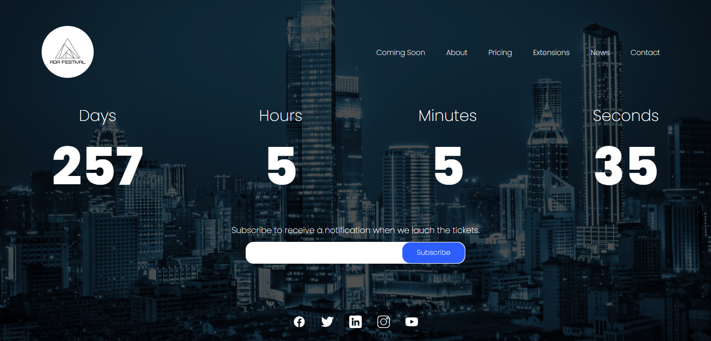
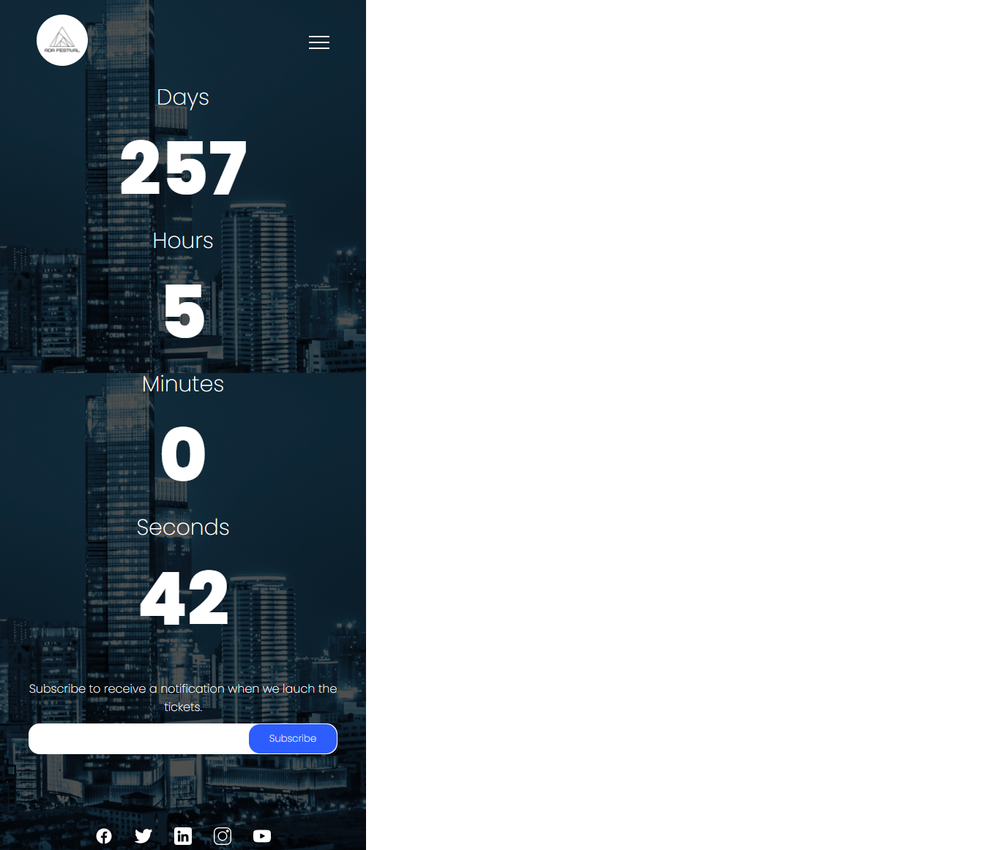

<h1 align="center">
  ⏲️ Countdown Timer
</h1>

  <a href="#-tecnologias">Tecnologias</a>&nbsp;&nbsp;&nbsp;|&nbsp;&nbsp;&nbsp;
  <a href="#-projeto">Projeto</a>&nbsp;&nbsp;&nbsp;|&nbsp;&nbsp;&nbsp;
  <a href="#memo-licença">Licença</a>

  
  

 

## 📖 Descrição

Este projeto é um site responsivo que apresenta uma contagem regressiva para um evento. Inclui um campo de submissão de email para notificação do fim da contagem regressiva. O email é armazenado na LocalStorage após pressionar o botão.
 
Na versão Mobile há um menu hamburguer para navegação. Ao ser clicado abre um modal com o menu.

## 🚀 Tecnologias

Este projeto foi desenvolvido com as seguintes tecnologias:

- HTML
- CSS
- JavaScript

## 🚧 Projeto

Live Preview: https://countdown-timer-khaki.vercel.app/

<h3 align="center"><strong>Desktop</strong></h3>

<h3 align="center"><strong>Mobile</strong></h3>

## 🎨 Inspiração

[Dribbble](https://dribbble.com/shots/11931989-DailyUI-014-Countdown-Timer?utm_source=Clipboard_Shot&utm_campaign=crististan&utm_content=DailyUI%20-%20014%20-%20Countdown%20Timer&utm_medium=Social_Share&utm_source=Clipboard_Shot&utm_campaign=crististan&utm_content=DailyUI%20-%20014%20-%20Countdown%20Timer&utm_medium=Social_Share)

## 🎨 Créditos

Imagem Background: https://br.freepik.com/fotos-vetores-gratis/negocio

## 📝 Licença

Esse projeto está sob a licença MIT. Veja o arquivo [LICENSE](.github/LICENSE) para mais detalhes.

---

Feito com ♥ by Vitoria Nobre